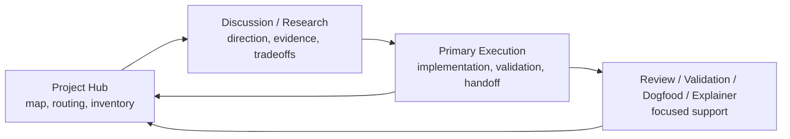
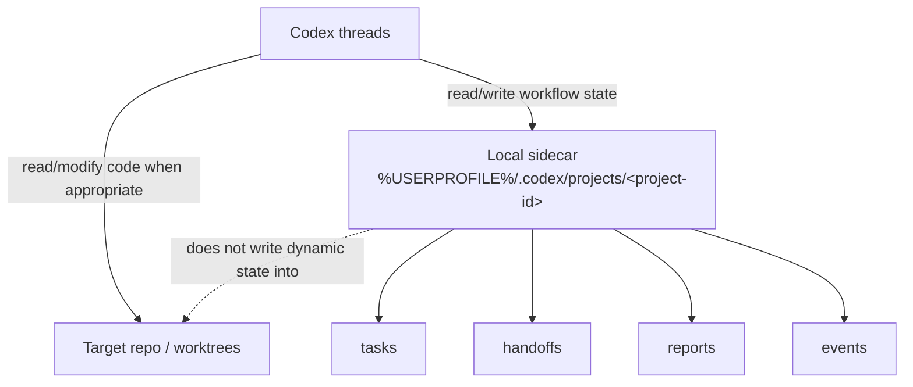

# Agent Workflow Hub

[中文](./README.zh-CN.md) | English

Agent Workflow Hub is a local workflow-state layer for multi-worktree, multi-thread agent development.

It helps Codex coordinate which task is active, which worktree owns it, what was validated, what is unknown, what is stale, and which thread should act next. It is not a replacement for model memory, code understanding, tests, PR review, or project management tools.

The normal interface is conversation:

```text
Use $agent-workflow-hub to resume this worktree.
```

## What It Is

Agent Workflow Hub coordinates project hubs, execution threads, worktrees, tasks, handoffs, validation, safety rules, and routing receipts through a local sidecar.

The sidecar records explicit, auditable workflow state. Native agent memory can remember preferences and recent conversation context; AWH records project coordination facts that should survive across chats, branches, worktrees, and agents.

## Why It Exists

- New threads need reliable task and worktree routing.
- Feature branches lose intent, validation status, blockers, and next steps.
- Project hub threads need real worktree inventory, not only sidecar-known tasks.
- Handoffs need to separate facts, inferences, unknowns, validation, and safety rules.
- Dynamic agent workflow state should stay outside the target repository.

For the longer product framing, see [Workflow Value Positioning](./docs/product/workflow-value-positioning.md).

## Quick Start

Install the skill packages:

```powershell
python install.py
```

Then ask Codex from any Git project or worktree:

```text
Use $agent-workflow-hub to run doctor/setup for this project.
```

Start a feature:

```text
Use $agent-workflow-hub to start this feature. Goal: improve the dashboard UI.
```

Resume the current worktree:

```text
Use $agent-workflow-hub to resume this worktree and tell me the immediate next step.
```

Continue by a human phrase:

```text
Use $agent-workflow-hub to continue markerless clean.
```

Save a handoff:

```text
Use $agent-workflow-hub to save a handoff before I stop today.
```

Audit the whole project hub:

```text
Use $agent-workflow-hub to audit this project hub across all worktrees.
```

## Core Workflow

The default mental model is:

```text
Hub -> Discussion/Research -> Execution
```



Project Hub keeps the map and routing. Discussion and Research shape direction. Primary Execution implements, validates, and saves durable handoff state. Review, Validation, Dogfood, and Explainer threads provide focused support without becoming long-running owners by default.

## Role Charters

Thread roles are coordination roles, not capability limits. They tell an agent how to participate in the AWH workflow, how to treat sidecar/handoff state, where to report durable outcomes, and when to hand off.

Opening a role thread starts with orientation: scope, boundary, and possible next paths first; research, execution, audits, web search, and durable handoff begin after user direction.

- `hub`: project map, routing, inventory, prioritization, reports, and compact receipts.
- `discussion`: product, architecture, workflow, and implementation-route shaping.
- `research`: external evidence, prior art, ecosystem context, baselines, and feasibility.
- `primary-execution`: implementation, validation, handoff, finish/archive, and PR text.
- `review`: focused critique of code, design, rigor, or PR readiness.
- `validation`: exact checks, runtime evidence, browser/UI/a11y validation, or regressions.
- `dogfood`: real workflow feedback, reproduction notes, and issue drafts.
- `explainer`: onboarding, architecture, history, and reusable project explanations.

See [Thread Role Charters](./docs/reference/thread-role-charters.md) for the low-anchor coordination policy and demos.

## Common Workflows

| Goal | Ask Codex | Details |
| --- | --- | --- |
| Start or resume a feature | `Use $agent-workflow-hub to start this feature. Goal: ...` | [CLI actions](./docs/reference/cli-actions.md) |
| Continue by nickname | `Use $agent-workflow-hub to continue markerless clean.` | [Handoff loading](./docs/reference/handoff-loading.md) |
| Save current state | `Use $agent-workflow-hub to save a handoff before I stop today.` | [Thread continuity](./docs/workflows/thread-continuity.md) |
| Audit one worktree | `Use $agent-workflow-hub to audit this context before another agent takes over.` | [Review and validation](./docs/workflows/review-validation.md) |
| Audit all worktrees | `Use $agent-workflow-hub to audit this project hub across all worktrees.` | [Project hub workflow](./docs/workflows/project-hub.md) |
| Continue from an old thread | `Use $agent-workflow-hub to continue <continue phrase>.` | [Thread continuity](./docs/workflows/thread-continuity.md) |
| Draft dogfood feedback | `Use $agent-workflow-hub to draft a dogfood issue for this problem.` | [CLI actions](./docs/reference/cli-actions.md) |
| Finish a feature | `Use $agent-workflow-hub to finish this feature and generate PR text.` | [CLI actions](./docs/reference/cli-actions.md) |

## Documentation Map

- [Workflow Value Positioning](./docs/product/workflow-value-positioning.md): why AWH exists as workflow coordination, not memory replacement.
- [Thread Role Charters](./docs/reference/thread-role-charters.md): role coordination policy, demos, and design rationale.
- [Direct Plan To Execution](./docs/workflows/direct-plan-to-execution.md): how discussion/research hands work to execution.
- [Thread Continuity](./docs/workflows/thread-continuity.md): compact, section, and full handoff continuation.
- [Handoff Loading Reference](./docs/reference/handoff-loading.md): `load-handoff` modes and arguments.
- [Project Hub Workflow](./docs/workflows/project-hub.md): hub inventory and routing behavior.
- [Review And Validation](./docs/workflows/review-validation.md): focused review/validation handoff loading.
- [CLI Actions Reference](./docs/reference/cli-actions.md): action overview.
- [Events And Eval](./docs/reference/events-and-eval.md): workflow telemetry and proxy metrics.
- [Skill Maintenance](./skills/agent-workflow-hub/references/maintenance.md): source and install maintenance protocol.

## Install

Clone this repository, then run:

```powershell
python install.py
```

The installer copies both complete skill packages to:

```text
%USERPROFILE%\.codex\skills\agent-workflow-hub\
%USERPROFILE%\.codex\skills\context-handoff\
```

Restart or refresh Codex if the skill list does not update immediately. The installer only copies skill packages; it does not install GitHub CLI, authenticate accounts, or change global Codex configuration.

## Compatibility

`$agent-workflow-hub` is the default entrypoint from V2.7 onward.

`$context-handoff` remains available as a legacy compatibility entrypoint. It uses the same local sidecar data, CLI file name, and JSON schema. Existing state under `%USERPROFILE%\.codex\projects\<project-id>\` is not migrated.

## Local State And Safety

Dynamic workflow state stays local:

```text
%USERPROFILE%\.codex\projects\<project-id>\
  config.json
  active-tasks.json
  project-state.json
  handoffs\
  archive\
  reports\
  events.jsonl
```



Sidecar state is not a chat transcript database and not a model reasoning store. `resume-feature`, `resume-query`, and `load-handoff` restore recorded workflow state; they do not prove code correctness or replace validation.

## Maintenance

The installed skill directories are deployment copies. Make lasting changes in the canonical source checkout, then run `python install.py`. See [Skill Maintenance](./skills/agent-workflow-hub/references/maintenance.md) for the update protocol.
