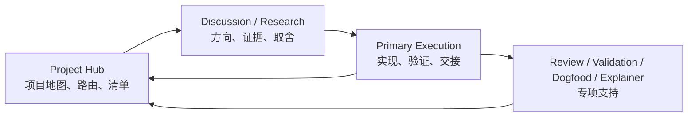
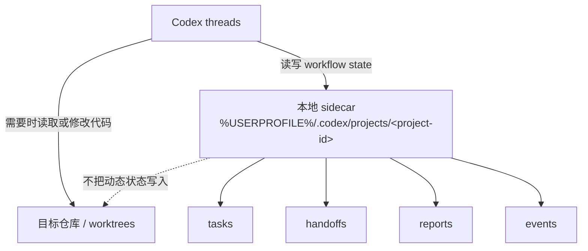

# Agent Workflow Hub

中文 | [English](./README.md)

Agent Workflow Hub 是一个本地 workflow state layer，用来协调多 worktree、多 thread 的 agent 开发。

它帮助 Codex 明确：当前哪个 task 在进行、由哪个 worktree 承担、验证过什么、哪些信息仍未知、哪些内容已经 stale，以及下一步应该交给哪个 thread。它不是模型 memory、代码理解、测试、PR review 或项目管理工具的替代品。

日常入口是自然语言：

```text
Use $agent-workflow-hub to resume this worktree.
```

## What It Is

Agent Workflow Hub 通过本地 sidecar 协调 project hub、execution thread、worktree、task、handoff、validation、safety rules 和 routing receipts。

sidecar 记录的是显式、可审计的 workflow state。原生 agent memory 适合记住用户偏好和近期对话；AWH 记录的是应该跨聊天、branch、worktree 和 agent 保留下来的项目协作状态。

## Why It Exists

- 新 thread 需要可靠的 task/worktree 路由。
- feature branch 容易丢失目标、验证状态、阻塞点和下一步。
- Project Hub 需要真实 worktree inventory，不能只看 sidecar 已登记 task。
- handoff 需要区分 facts、inferences、unknowns、validation 和 safety rules。
- 动态 agent workflow state 不应该写进目标仓库。

长版产品定位见 [Workflow Value Positioning](./docs/product/workflow-value-positioning.md)。

## Quick Start

安装 skill 包：

```powershell
python install.py
```

然后在任意 Git 项目或 worktree 中对 Codex 说：

```text
Use $agent-workflow-hub to run doctor/setup for this project.
```

开始一个 feature：

```text
Use $agent-workflow-hub to start this feature. Goal: improve the dashboard UI.
```

恢复当前 worktree：

```text
Use $agent-workflow-hub to resume this worktree and tell me the immediate next step.
```

用自然语言继续某个任务：

```text
Use $agent-workflow-hub to continue markerless clean.
```

保存 handoff：

```text
Use $agent-workflow-hub to save a handoff before I stop today.
```

审计整个 project hub：

```text
Use $agent-workflow-hub to audit this project hub across all worktrees.
```

## Core Workflow

默认心智模型是：

```text
Hub -> Discussion/Research -> Execution
```



Project Hub 维护项目地图和路由。Discussion 与 Research 塑形方向。Primary Execution 负责实现、验证和保存持久 handoff。Review、Validation、Dogfood、Explainer thread 提供专项支持，默认不成为长期 task owner。

## Role Charters

Thread role 是协作位置，不是 agent 能力边界。它告诉 agent 如何参与 AWH workflow、如何理解 sidecar/handoff state、把持久结果回传到哪里，以及什么时候应该 hand off。

- `hub`：项目地图、路由、清单、优先级、报告和紧凑回执。
- `discussion`：产品、架构、workflow 和实现路线塑形。
- `research`：外部证据、prior art、生态上下文、baseline 和可行性。
- `primary-execution`：实现、验证、handoff、finish/archive 和 PR 文案。
- `review`：针对代码、设计、严谨性或 PR ready 状态的专项 critique。
- `validation`：精确检查、运行证据、browser/UI/a11y validation 或 regression。
- `dogfood`：真实 workflow 反馈、复现信息和 issue draft。
- `explainer`：onboarding、架构、历史和可复用项目解释。

低锚定协作规则和 demo 见 [Thread Role Charters](./docs/reference/thread-role-charters.zh-CN.md)。

## Common Workflows

| 目标 | 对 Codex 说 | 详情 |
| --- | --- | --- |
| 开始或恢复 feature | `Use $agent-workflow-hub to start this feature. Goal: ...` | [CLI actions](./docs/reference/cli-actions.md)（英文参考） |
| 用 nickname 继续 | `Use $agent-workflow-hub to continue markerless clean.` | [Handoff loading](./docs/reference/handoff-loading.md)（英文参考） |
| 保存当前状态 | `Use $agent-workflow-hub to save a handoff before I stop today.` | [Thread continuity](./docs/workflows/thread-continuity.md)（英文参考） |
| 审计单个 worktree | `Use $agent-workflow-hub to audit this context before another agent takes over.` | [Review and validation](./docs/workflows/review-validation.md)（英文参考） |
| 审计所有 worktree | `Use $agent-workflow-hub to audit this project hub across all worktrees.` | [Project hub workflow](./docs/workflows/project-hub.md)（英文参考） |
| 从旧 thread 接续 | `Use $agent-workflow-hub to continue <continue phrase>.` | [Thread continuity](./docs/workflows/thread-continuity.md)（英文参考） |
| 草拟 dogfood 反馈 | `Use $agent-workflow-hub to draft a dogfood issue for this problem.` | [CLI actions](./docs/reference/cli-actions.md)（英文参考） |
| 完成 feature | `Use $agent-workflow-hub to finish this feature and generate PR text.` | [CLI actions](./docs/reference/cli-actions.md)（英文参考） |

## Documentation Map

- [Workflow Value Positioning](./docs/product/workflow-value-positioning.md)（英文参考）：为什么 AWH 是 workflow coordination，而不是 memory replacement。
- [Thread Role Charters](./docs/reference/thread-role-charters.zh-CN.md)：role 协作规则、demo 和设计理由。
- [Direct Plan To Execution](./docs/workflows/direct-plan-to-execution.md)（英文参考）：discussion/research 如何把工作交给 execution。
- [Thread Continuity](./docs/workflows/thread-continuity.md)（英文参考）：compact、section、full handoff 接续。
- [Handoff Loading Reference](./docs/reference/handoff-loading.md)（英文参考）：`load-handoff` 模式和参数。
- [Project Hub Workflow](./docs/workflows/project-hub.md)（英文参考）：hub inventory 和 routing 行为。
- [Review And Validation](./docs/workflows/review-validation.md)（英文参考）：review/validation 的 focused handoff loading。
- [CLI Actions Reference](./docs/reference/cli-actions.md)（英文参考）：action 概览。
- [Events And Eval](./docs/reference/events-and-eval.md)（英文参考）：workflow telemetry 和 proxy metrics。
- [Skill Maintenance](./skills/agent-workflow-hub/references/maintenance.md)（英文参考）：source 和安装维护协议。

## Install

clone 本仓库后运行：

```powershell
python install.py
```

安装器会把两个完整 skill 包复制到：

```text
%USERPROFILE%\.codex\skills\agent-workflow-hub\
%USERPROFILE%\.codex\skills\context-handoff\
```

如果 Codex 没有立刻刷新 skill 列表，请重启或刷新 Codex。安装器只复制 skill 包，不会安装 GitHub CLI，不会登录账号，也不会修改全局 Codex 配置。

## Compatibility

`$agent-workflow-hub` 是 V2.7 之后的默认入口。

`$context-handoff` 仍作为 legacy compatibility entrypoint 保留。它使用同一套本地 sidecar 数据、CLI 文件名和 JSON schema。已有 `%USERPROFILE%\.codex\projects\<project-id>\` 状态不会迁移。

## Local State And Safety

动态 workflow state 只保存在本机：

```text
%USERPROFILE%\.codex\projects\<project-id>\
  config.json
  active-tasks.json
  project-state.json
  handoffs\
  archive\
  reports\
  events.jsonl
```



sidecar 不是聊天记录库，也不是模型思维链存储。`resume-feature`、`resume-query` 和 `load-handoff` 恢复的是已记录 workflow state；它们不证明代码正确，也不能替代 validation。

## Maintenance

已安装的 skill 目录是部署副本。长期修改应在 canonical source checkout 中完成，然后运行 `python install.py`。更新协议见 [Skill Maintenance](./skills/agent-workflow-hub/references/maintenance.md)。
